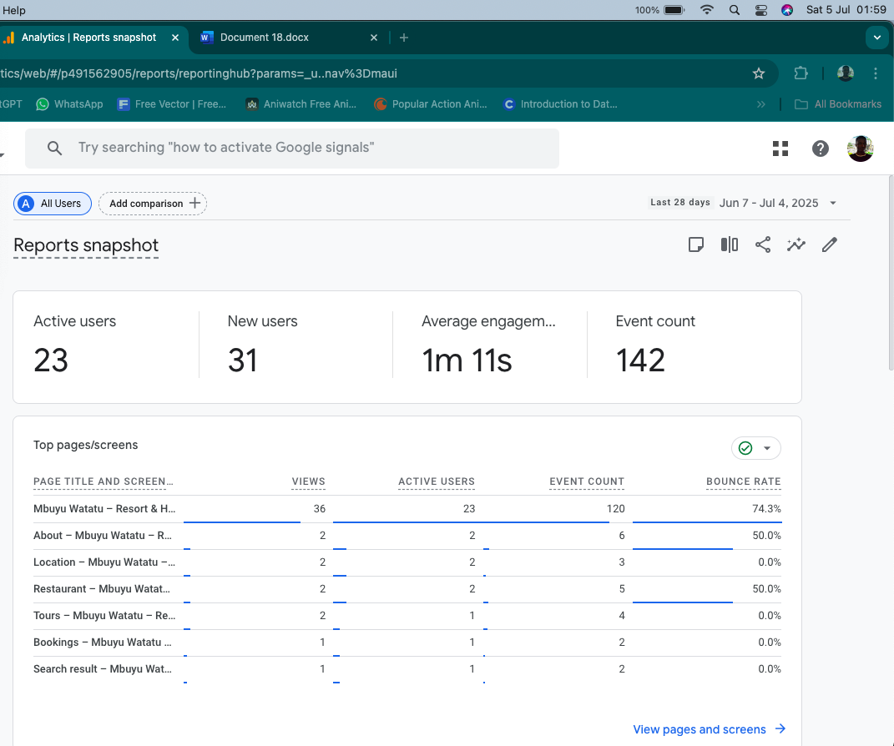
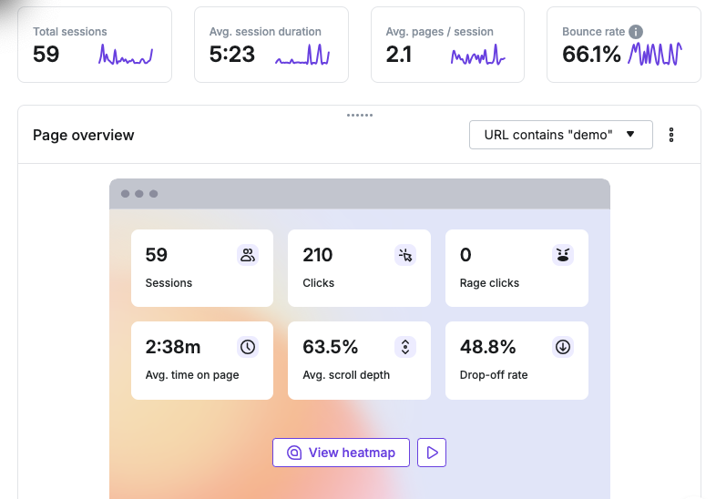

# Tyrone John – Aspiring Data Analyst
I am an entry-level data analyst with skills in Excel, web design & development, and SEO. This project demonstrates my ability to analyze business data and generate actionable insights.

## Project: Hotel Booking & Marketing Analysis

### Objective
Market and analyze website traffic and booking patterns to improve performance and engagement.

### Tools
- Excel (data cleaning, pivot tables, dashboards)
- Google Analytics

## Website Analytics

This chart displays the amount of new users after marketing and implementing changes.

The chart displays strong click activity that suggests interest but possible UX issues.

### Website Behavior Analysis
- Key Metrics Observed
- 59 user sessions recorded
- 210 total clicks
- Average session duration: 2 minutes 38 seconds
- Scroll depth: 63.5%
- Drop-off rate: 48.8%

### Key Insights
- Traffic increases after marketing campaign
- Mobile users dominate
- Users engage well but don’t fully convert
- Nearly half drop off before completing actions
- Strong click activity suggests interest but possible UX issues

### Recommendations
- Focus on mobile optimization
- Improve call-to-action placement
- Reduce friction in booking process
- Optimize high drop-off sections

### Contact
- Email: tyronejohn001@gmail.com
- Phone: 0792381698
- Location: Nairobi, Kenya
